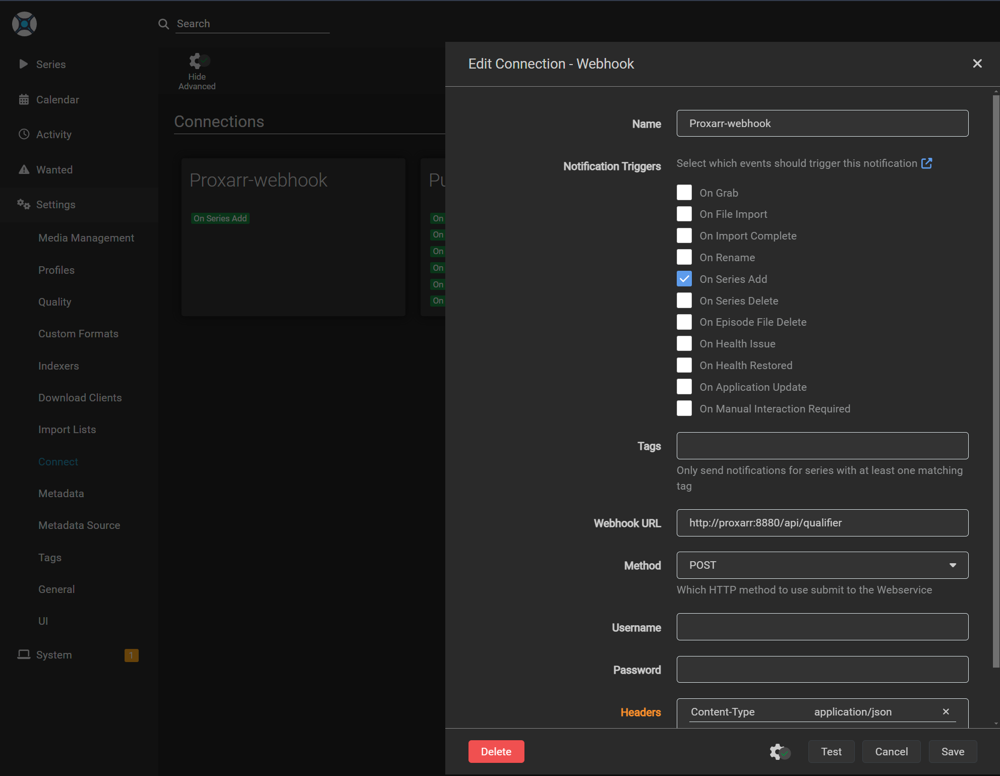

<a id="readme-top"></a>
[![Contributors][contributors-shield]][contributors-url]
[![Forks][forks-shield]][forks-url]
[![Stargazers][stars-shield]][stars-url]
[![Issues][issues-shield]][issues-url]
[![project_license][license-shield]][license-url]
[![LinkedIn][linkedin-shield]][linkedin-url]

[](https://github.com/Fazzani/Proxarr/actions/workflows/docker-image.yml)
[](https://github.com/Fazzani/Proxarr/actions/workflows/pr.yml)


<!-- PROJECT LOGO -->
<br />
<div align="center">
  <a href="https://github.com/Fazzani/Proxarr">
    
  </a>

  <p align="center">
    Automatically categorize your requested movies and tv shows from your watching providers.
    <br />
    <a href="https://github.com/Fazzani/Proxarr/issues/new?labels=bug&template=bug-report.yml">:boom: Report Bug :boom:</a>
    ·
    <a href="https://github.com/Fazzani/Proxarr/issues/new?labels=enhancement&template=feature-request.yml">:sparkles: Request Feature :sparkles:</a>
  </p>
</div>

<!-- TABLE OF CONTENTS -->
<details>
  <summary>Table of Contents</summary>
  <ol>
    <li>
      <a href="#about-the-project">About The Project</a>
    </li>
    <li>
      <a href="#getting-started">Getting Started</a>
      <ul>
        <li><a href="#prerequisites">Prerequisites</a></li>
        <li><a href="#installation-with-docker-compose">Installation with Docker compose</a></li>
      </ul>
    </li>
    <li><a href="#roadmap">Roadmap</a></li>
    <li><a href="#contributing">Contributing</a></li>
  </ol>
</details>

<!-- ABOUT THE PROJECT -->
## About The Project

Proxarr is a lightweight proxy server for automatically qualify requested media items based in countries served by watching providers.
It uses TMDB to find out which streaming services are available in the selected region.


<p align="right"><a href="#readme-top"></a></p>

<!-- GETTING STARTED -->
## Getting Started

### Prerequisites

* Acquire TMDB API KEY
  [How](https://dev.to/codexive_zech/streamlining-your-contribution-how-to-get-your-tmdb-api-key-for-ldbflix-contribution-52gf#:~:text=How%20to%20Obtain%20a%20TMDB%20API%20Key)
* Obtain SONARR/RADARR API KEY<br/>
  

### Installation with Docker compose

1. Prepare your [config.yml][config-yml] to fit your setup
2. On your Radarr/Sonarr instances we have to do some changes
   - tag all indexers by the TAG_NAME defined in your [config.yml][config-yml] (`q` by default)<br/>
     
   - specify Application URL: is essential because it is used by Proxarr to determine to which instance should return the response<br/>
     
   - establish a Webhook connection between Sonarr/Radarr and Proxarr<br/>
     <br/>
     _Note_ : Webhook URL is `http://<Proxarr_Instance>/api/qualifier
3. Add the following to your docker-compose.yml (to be adapted according to your stack)<br/>
   [docker-compose.yml](docker-compose.yml) is an another full example of how to integrate Proxarr with Sonarr and Radarr.
   ```yaml
      proxarr:
        image: synker/proxarr:latest
        container_name: proxarr
        restart: unless-stopped
        depends_on:
          sonarr:
            condition: service_healthy
          radarr:
            condition: service_healthy
        healthcheck:
          test: curl --fail http://localhost:8880/health || exit 1
          interval: 10s
          retries: 3
          start_period: 5s
          timeout: 3s
        ports:
          - "8880:8880"
        environment:
          - LOG_LEVEL=Information
          - TZ="Europe/Paris"
        volumes:
          - ./:/app/config
          - ./logs:/logs"
   ```
    
4. Run 
   ```shell
    docker compose -f docker-compose.yml up -d
    ```
> Standalone docker container example

```shell
docker run -itd --rm -e LOG_LEVEL=Debug -p 8880:8880 -v ${PWD}/config:/app/config --name proxarr synker/proxarr:latest
```

<p align="right"><a href="#readme-top"></a></p>

### Watching providers configuration

- [TMDB API to get available regions](https://developer.themoviedb.org/reference/watch-providers-available-regions)
- [TMDB API to get available movie providers by region](https://developer.themoviedb.org/reference/watch-providers-movie-list)
- [TMDB API to get available tv providers by region](https://developer.themoviedb.org/reference/watch-providers-tv-list)

<!-- ROADMAP -->
## Roadmap

- [ ] Add more providers (JustWatch, Reelgood, etc)
- [ ] Add more tests
- [ ] Improve logging and error handling
- [ ] Add Api versioning
 
See the [open issues](https://github.com/Fazzani/Proxarr/issues) for a full list of proposed features (and known issues).

<p align="right"><a href="#readme-top"></a></p>

<!-- CONTRIBUTING -->
## Contributing

Contributions are what make the open source community such an amazing place to learn, inspire, and create. Any contributions you make are **greatly appreciated**.
Don't forget to give the project a :star: star :star: ! Thanks again!

For further information, [click here](CONTRIBUTING.md)

### Top contributors:

<a href="https://github.com/Fazzani/Proxarr/graphs/contributors">
  
</a>

<p align="right"><a href="#readme-top"></a></p>

<!-- MARKDOWN LINKS & IMAGES -->
[contributors-shield]: https://img.shields.io/github/contributors/Fazzani/Proxarr.svg?style=for-the-badge
[contributors-url]: https://github.com/Fazzani/Proxarr/graphs/contributors
[forks-shield]: https://img.shields.io/github/forks/Fazzani/Proxarr.svg?style=for-the-badge
[forks-url]: https://github.com/Fazzani/Proxarr/network/members
[stars-shield]: https://img.shields.io/github/stars/Fazzani/Proxarr.svg?style=for-the-badge
[stars-url]: https://github.com/Fazzani/Proxarr/stargazers
[issues-shield]: https://img.shields.io/github/issues/Fazzani/Proxarr.svg?style=for-the-badge
[issues-url]: https://github.com/Fazzani/Proxarr/issues
[license-shield]: https://img.shields.io/github/license/Fazzani/Proxarr.svg?style=for-the-badge
[license-url]: https://github.com/Fazzani/Proxarr/blob/master/LICENSE.txt
[linkedin-shield]: https://img.shields.io/badge/-LinkedIn-black.svg?style=for-the-badge&logo=linkedin&colorB=555
[linkedin-url]: https://www.linkedin.com/in/heni-fazzani
[arr-api-key]: images/arr_api_key.png
[config-yml]: ./src/Proxarr.Api/config.yml